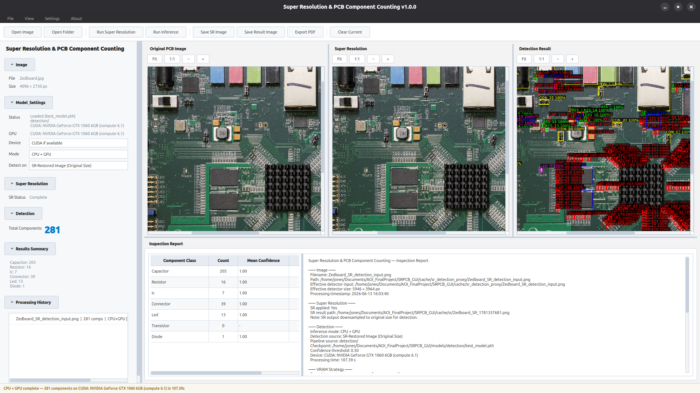
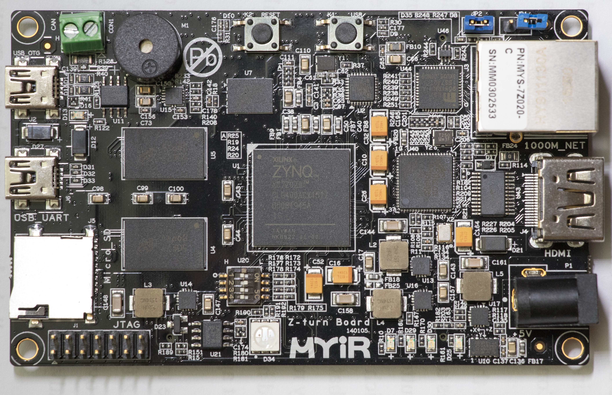

# Super Resolution & PCB Component Detection

We combined PCB image super-resolution (SR) with Faster R-CNN component counting in a single detection pipeline on the [FICS-PCB Dataset](https://trust-hub.org/#/data/fics-pcb). Our main goal is to improve the performance for small components (SMDs) and making a user interface that is easy to use.

**Course:** Automated Optical Inspection, National Taiwan University (2026)

**Project:** Machine Learning-Based PCB Image Restoration and Quality Assurance for Automated Optical Inspection

---

## Preview



| Input | Super Resolution | Detection Result |
|---|---|---|
|  |  |  |

**Unseen PCB** (not in dataset):

| Input | Detection Result |
|---|---|
|  |  |

Performance on an unseen PCB shows that the method works well, though results could be improved with fine-tuning on more diverse data.

---

## Features

* Open PCB images or folders
* Run super-resolution (tiled EDSRLite model)
* Run Faster R-CNN component counting (detection pipeline)
* Detect on original image or SR-restored original-size proxy
* VRAM-aware detection strategy, adapts tiling to available GPU memory
* Zoomable/pannable image viewers (original, SR, detection)
* Save SR image, save annotated detection image
* Export component counts CSV
* Export PDF inspection report
* Processing history with pin, restore, and delete

---

## Pipeline

```
Input PCB Image
      │
      ├── Super Resolution → Full SR Output
      │                          │
      │                          └── Component Counting using SR Image
      │
      └── Component Counting → Annotated Result → PDF Report
```

---

## Performance

Evaluated on the [FICS-PCB dataset](https://trust-hub.org/#/data/fics-pcb) (WACV 2019 PCB component dataset).

Reference paper: [*Component Counting for PCB Boards*](https://eprint.iacr.org/2020/366).

### Detection on original images

| Metric | Value | Counts |
|---|---|---|
| Micro Precision | 0.9734 | TP 6434 / FP 176 |
| Micro Recall | 0.9610 | TP 6434 / FN 261 |
| Micro F1 | 0.9672 | |
| Macro Precision | 0.9629 | |
| Macro Recall | 0.9231 | |
| Macro F1 | 0.9411 | |

### Detection on SR-restored images

| Metric | Value | Counts |
|---|---|---|
| Micro Precision | 0.9714 | TP 6416 / FP 189 |
| Micro Recall | 0.9583 | TP 6416 / FN 279 |
| Micro F1 | 0.9648 | |
| Macro Precision | 0.9591 | |
| Macro Recall | 0.9206 | |
| Macro F1 | 0.9379 | |

### SR-restored vs original (delta)

| Metric | Delta |
|---|---|
| Micro F1 | −0.0023 |
| Macro F1 | −0.0032 |

The SR-restored path shows a negligible drop in detection quality (≤0.3% F1), confirming that the SR-restored original-size proxy preserves component-counting accuracy while reducing GPU memory pressure.

### Why the detector was challenged on the FICS-PCB dataset

The FICS-PCB dataset consists of high-resolution PCB images (most at 4928&times;3264 px or higher). These images are already sharp and well-lit at the component scale, many components occupy a large pixel area before any processing. The model was not fine-tuned on super-resolved or artificially sharpened images, so the SR pipeline does not have an opportunity to meaningfully improve small-component edges beyond what the original sensor already captured. The 4&times; upscale effectively injects interpolated detail and minor artifacts that the detector must then sort through, producing a marginal F1 reduction rather than a gain.

For *lower-quality* PCB imaging (lower resolution, noise, compression artifacts), super-resolution would be expected to provide a measurable detection benefit by restoring fine component boundaries that the base image lacks.

---

## Model Architecture

### Super-Resolution Model

The super-resolution module uses EDSRLite, a lightweight EDSR variant implemented in PyTorch. Configuration is read from the checkpoint at load time; the defaults are shown below.

| Parameter | Value |
|---|---|
| Model | EDSRLite (EDSR variant) |
| Scale factor | 4&times; |
| Input channels | 3 (RGB) |
| Feature channels | 64 |
| Residual blocks | 8 |
| Checkpoint | `models/super_resolution/best_model.pth` |

The program processes large PCB images via **tiled inference** (32&times;32 px patches, stride 24, scale 4) with GPU-batched execution. Batch size adapts to available VRAM at runtime.

Tiling parameters are defined in `inference/sr_engine.py`.

The GUI produces two outputs from each SR run:

* **Full SR output**: the complete 4&times; upscaled image, used for visual inspection, display, and export.
* **SR-restored detection**: the SR output resized back to the original image dimensions, used as the detection input when &ldquo;SR-Restored Image (Original Size)&rdquo; is selected. This keeps restoration benefits while avoiding CUDA out-of-memory errors from feeding full-resolution SR canvases into Faster R-CNN.

### Faster R-CNN Component Detection

The detection module uses Faster R-CNN with a ResNet-50 FPN backbone, built on torchvision. The model is initialised from COCO-pretrained weights and fine-tuned on the WACV 2019 PCB component dataset.

| Parameter | Value |
|---|---|
| Architecture | Faster R-CNN (ResNet-50 FPN) |
| Framework | PyTorch / torchvision |
| Pretrained | COCO (`FasterRCNN_ResNet50_FPN_Weights.DEFAULT`) |
| Input size | 1024&times;1024 (scale-locked) |
| Anchor sizes | (8,16), (32,48), (64,128), (256,384), (512,768) |
| Anchor ratios | 0.125, 0.25, 0.5, 1.0, 2.0, 4.0, 8.0 |
| Box detections per image | 800 |
| Component classes | 7 — capacitor, resistor, IC, connector, LED, transistor, diode |
| Checkpoint | `models/detection/best_model.pth` |

Detection uses a three-pass pipeline:

* **Pass A**: Full-frame baseline inference. Runs the detector across the entire image at once to capture large components (ICs, connectors) that span tile boundaries. Because Pass A operates on the full image, it uses the most GPU memory. The entire PCB image gets downsampled to 1024x1024 for the detection model.
* **Pass B**: Tiled inference at 1024&times;1024 px with 60% overlap. Each tile is processed independently by the detector, recovering components at native resolution after Pass A context has been established.
* **Pass C**: Tiled inference at 512&times;512 px with 60% overlap, upsampled to 1024x1024 px for the detection model. Pass C targets small SMD components (capacitors, resistors, LEDs) that may be missed by the coarser Pass B tiles.

Detections from all three passes are merged with class-aware NMS that protects Pass A large-component predictions from being suppressed by overlapping Pass B/C tile predictions. Edge components are recovered via coordinate expansion against raw Pass A boxes.

For large images, Pass A can be moved to CPU to stay within GPU memory limits (&ldquo;CPU + GPU&rdquo; mode). Pass B and Pass C always run on the configured device with fixed tile sizes.

Three detection modes are available:

* **CPU + GPU** (default): Pass A on CPU for large/high-risk images; Pass B/C on GPU. This is necessary if the GPU being used does not have enough VRAM to inference the input image.
* **GPU only**: full pipeline on GPU.
* **Fast Preview**: Pass A only, for quick results.

Thresholds and NMS parameters are configured in `inference/aoi_inference_engine.py`.

Detection output includes bounding boxes, class labels, confidence scores, per-class counts, total component count, and an annotated result image.

### Architecture Diagram

```
Input PCB Image
      │
      ├── Super-Resolution CNN (EDSRLite, 4×)
      │       ├── Full SR Output — inspection and export
      │       └── SR-Restored Original-Size Proxy — detection input
      │
      └── Faster R-CNN Detector (ResNet-50 FPN)
              ├── Bounding boxes and class labels
              ├── Confidence scores
              ├── Component counts per class
              └── Annotated result image
```

---

## Installation

### 1. Create virtual environment

```bash
python3 -m venv .venv
source .venv/bin/activate
python3 -m pip install --upgrade pip
```

### 2. Install PyTorch

Choose the build matching your hardware:

```bash
# CPU only
pip install torch torchvision --index-url https://download.pytorch.org/whl/cpu

# CUDA 12.8
pip install torch torchvision --index-url https://download.pytorch.org/whl/cu128

# CUDA 12.4 (older GPUs, e.g. GTX 1060 Pascal)
pip install torch torchvision --index-url https://download.pytorch.org/whl/cu124
```

Use the PyTorch wheel that matches your NVIDIA driver and CUDA version: [pytorch.org/get-started/locally](https://pytorch.org/get-started/locally)

### 3. Install application dependencies

```bash
pip install -r requirements.txt
```

### Alternative: setup script

```bash
chmod +x setup_env.sh
./setup_env.sh
```

---

## Running

Tested on **Ubuntu 26.04 LTS (Resolute Raccoon)** with Python 3.12, PyTorch 2.5.1+cu124, and PyQt 6.6.

```bash
chmod +x srpcb.sh
./srpcb.sh
```

Wayland fallback:

```bash
QT_QPA_PLATFORM=xcb ./srpcb.sh
```

---

## Repository structure

```
SRPCB_GUI/
├── srpcb.sh                   launch script
├── setup_env.sh               install helper
├── requirements.txt
├── app/                       GUI, workers, table model, styles, paths
│   ├── main.py                entry point
│   ├── main_window.py         main window and layout
│   ├── image_viewer.py        zoom/pan QGraphicsView
│   ├── worker.py              inference worker thread
│   ├── sr_worker.py           super-resolution worker thread
│   ├── results_model.py       results table model
│   ├── status_line.py         status bar controller
│   ├── styles.py              Qt stylesheet (light theme)
│   └── paths.py               centralized path resolver
├── inference/                 detection and SR engine wrappers
│   ├── aoi_inference_engine.py
│   ├── sr_engine.py
│   ├── detection_result.py
│   └── vram_strategy.py
├── detection/                 detection pipeline source
│   ├── pretrained_model.py
│   ├── dataset_v4.py
│   └── inference_v4.py
├── super_resolution/          SR model definition
│   └── model.py
├── reports/                   report builder and PDF exporter
│   ├── report_builder.py
│   └── pdf_exporter.py
├── history/                   processing history manager
│   └── history_manager.py
├── utils/                     annotation drawing utilities
│   └── annotation.py
├── models/                    model checkpoints
│   ├── detection/
│   └── super_resolution/
├── docs/                      preview images and screenshots
├── cache/                     runtime cache (annotated, SR, proxies)
├── outputs/                   exported files
└── logs/                      application logs
```

---

## Model Weights

Model weights are distributed through the GitHub Releases page because they exceed normal GitHub repository file size limits.

Download the release assets:

- `SRPCB_detection_best_model.pth`
- `SRPCB_super_resolution_best_model.pth`

Then place them as:

```text
models/detection/best_model.pth
models/super_resolution/best_model.pth
```

## Credits

Developed for the final project of the **Automated Optical Inspection** course at National Taiwan University.

* **Steven Jones** — PCB component counting, Faster R-CNN inference integration, GUI, and reporting.
* **Isabella Scalia** — PCB super-resolution, image restoration workflow, SR model integration, and reporting.

---

## License

This project is under the MIT License. Feel free to reuse and modify it!
